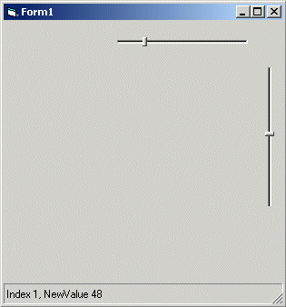



## Simple Slider

### Description

A simple slider control with no tickmarks, that looks attractive at small sizes (no appearance bug like exists in VB6's control). In addition, clicking on the slider bar jumps the thumb directly to that point - there's no need to 'page up' and 'page down' continuously to get there.
 
### More Info
 

             |
---                |---
**Submitted On**   |2003-10-11 01:27:50
**By**             |[Kamilche](https://github.com/Planet-Source-Code/PSCIndex/blob/master/ByAuthor/kamilche.md)
**Level**          |Beginner
**User Rating**    |3.8 (15 globes from 4 users)
**Compatibility**  |VB 5\.0, VB 6\.0
**Category**       |[Custom Controls/ Forms/  Menus](https://github.com/Planet-Source-Code/PSCIndex/blob/master/ByCategory/custom-controls-forms-menus__1-4.md)
**World**          |[Visual Basic](https://github.com/Planet-Source-Code/PSCIndex/blob/master/ByWorld/visual-basic.md)
**Archive File**   |[Simple\_Sli16569110112003\.zip](https://github.com/Planet-Source-Code/kamilche-simple-slider__1-49166/archive/master.zip)

